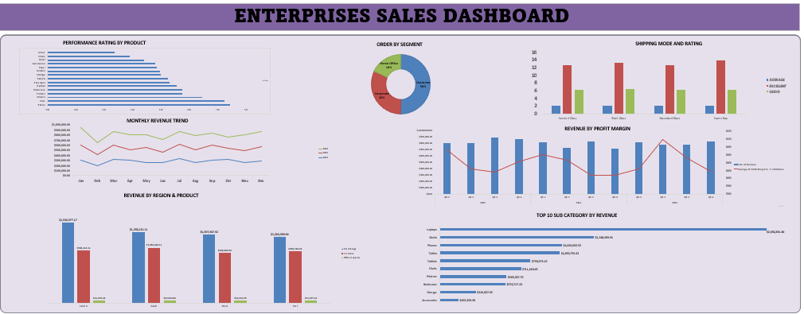

##Driving Growth Without Margin Erosion (2022–2024)
Uncovered how the business achieved growth with stable margins, highlighting opportunities in demand forecasting and portfolio efficiency.

# Executive Summary
Strong revenue concentration in Technology
Stable ~60% profit margins across segments and discount tiers
Predictable Q3 seasonal peaks
Delivery speed strongly impacts customer satisfaction
Early signs of cost inefficiency in select sub-categories

Insight: Structurally healthy business with clear opportunities in optimization and demand planning.

# 1. Where Is Revenue Truly Coming From?
Finding: Revenue is category-driven, not region-driven.
Technology leads with $5.47M
Central region tops at $2.6M, but category dominance is consistent
Implication: Growth is driven by product strength → lower regional risk, higher category concentration risk.

# 2. Is Growth Sacrificing Margin?
Finding: Profit margins remain stable at ~60% across all segments and discount tiers.
Implication: Strong pricing discipline and clear evidence of growth without margin dilution.

# 3. Is Demand Random or Predictable?
Finding: Q3 consistently records peak order volumes.
Implication: Predictable seasonality enables:
Inventory optimization
Targeted marketing
Supply chain scaling

 # 4. Operational Performance & Customer Experience
Finding: Same-day delivery drives the highest “Excellent” ratings.
Implication: Faster delivery = higher satisfaction → operational efficiency directly protects revenue.

# 5. Portfolio Efficiency: A Hidden Risk Signal
Finding: High-cost items (e.g., Chairs) are not top revenue contributors.
Implication: Opportunity for:
Cost restructuring
Supplier renegotiation
Product rationalization

# 6. Strategic Takeaways
Revenue resilience
Margin discipline
Operational leverage
Predictable demand cycles

# Conclusion:
This is not a turnaround story — it’s a scaling opportunity.
Next phase: optimize portfolio mix, monetize seasonality, and strengthen operational differentiation.
